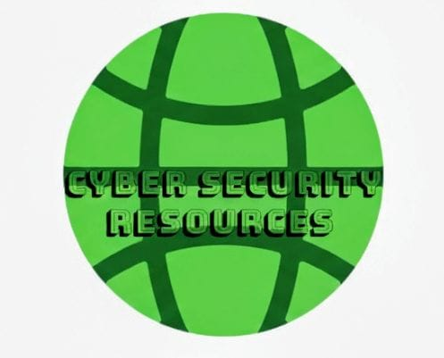

  

    
  

   
  <h6>The Complete Cyber Security Resource Hub</h6>
  

    Created & Maintained by Vishant Chaudhary
     
    Connect with me on 
      <a href="https://www.linkedin.com/in/vishant--chaudhary">LinkedIn</a>, 
      <a href="https://x.com/iam_vishant/">Twitter</a>.
    
  

---

<h1 align="center">🛡️ Awesome-CyberLearn-Path</h1>

  <b>The ultimate open-source roadmap to learn Cybersecurity — from zero to professional.</b> 
  Built and maintained by <a href="https://github.com/im-vishu">Vishant Chaudhary</a> 👨‍💻  
   
  <i>Building secure web apps & exploring ethical hacking</i>

---

## 📘 Table of Contents
1. [What This Repo Is](#-what-this-repo-is)
2. [Why I Built This](#-why-i-built-this)
3. [Learning Roadmap](#-learning-roadmap)
4. [Resources & Tools](#-resources--tools)
5. [Certifications](#-certifications)
6. [Projects & Portfolio](#-projects--portfolio)
7. [90-Day Learning Challenge](#-90-day-learning-challenge)
8. [Ethics & Safety](#-ethics--safety)
9. [Contributing](#-contributing)
10. [Connect With Me](#-connect-with-me)

---

## 🚀 What This Repo Is

**Awesome-CyberLearn-Path** is a curated, practical guide to mastering cybersecurity —  
combining structured learning paths, verified resources, and real-world project ideas.

Whether you want to become a **SOC Analyst, Penetration Tester, Threat Hunter, or Security Engineer**,  
this repo gives you the tools and roadmap to get there.

---

## 💡 Why I Built This

When I started learning cybersecurity, I realized most resources were scattered — some too basic, others too advanced.  
So I created this project to **help learners move step-by-step from zero to employable**, using real platforms, labs, and community tools.

If this helps you, consider giving it a ⭐ — that’s how we grow open knowledge together.

---

## 🧭 Learning Roadmap

| Level | Focus | Example Platforms |
|-------|--------|-------------------|
| 🥇 Beginner | Networking · Linux · Security Fundamentals | [TryHackMe](https://tryhackme.com) · [SANS Cyber Aces](https://www.sans.org/cyberaces) |
| 🧩 Intermediate | SIEM · Forensics · Web & Network Pentesting | [HackTheBox](https://www.hackthebox.com) · [PortSwigger Academy](https://portswigger.net/web-security) |
| 🚀 Advanced | Cloud Security · Threat Intel · Red Team Ops | [OffSec](https://www.offsec.com) · [MITRE ATT&CK](https://attack.mitre.org) |

Full details: [ROADMAP.md](./ROADMAP.md)

---

## 🧰 Resources & Tools

### 🔍 Learning Platforms
- [TryHackMe](https://tryhackme.com) — gamified cybersecurity labs  
- [HackTheBox](https://www.hackthebox.com) — real-world penetration testing challenges  
- [PortSwigger Academy](https://portswigger.net/web-security) — learn web app security  
- [OverTheWire](https://overthewire.org) — beginner-friendly Linux and hacking games  

### 🧪 Practice Labs & CTFs
- [CTFtime](https://ctftime.org) — calendar of global Capture-the-Flag events  
- [VulnHub](https://www.vulnhub.com) — downloadable vulnerable machines  
- [PicoCTF](https://picoctf.org) — beginner CTF by Carnegie Mellon University  

### ⚙️ Must-Know Tools
| Category | Tools | Official Docs |
|-----------|--------|---------------|
| Network Scanning | [Nmap](https://nmap.org) | [Docs](https://nmap.org/book/man.html) |
| Traffic Analysis | [Wireshark](https://www.wireshark.org) | [Docs](https://www.wireshark.org/docs/) |
| Web Testing | [Burp Suite](https://portswigger.net/burp) | [Docs](https://portswigger.net/burp/documentation) |
| Forensics | [Volatility](https://www.volatilityfoundation.org) | [Docs](https://volatility3.readthedocs.io/) |
| SIEM | [Splunk](https://www.splunk.com) · [ELK Stack](https://www.elastic.co/elk-stack) | [Docs](https://docs.splunk.com) |

---

## 🎓 Certifications

| Level | Certifications | Focus |
|--------|----------------|-------|
| 🧱 Beginner | [CompTIA Security+](https://www.comptia.org/certifications/security) · [Cisco CyberOps](https://www.cisco.com) | Core concepts, Blue Team |
| ⚔️ Intermediate | [eJPT](https://ine.com) · [PNPT](https://certifications.tcm-sec.com) | Offensive Security, Pentesting |
| 🧠 Advanced | [OSCP](https://www.offsec.com/courses/pen-200) · [CISSP](https://www.isc2.org/Certifications/CISSP) | Deep specialization, Leadership |

Full certification roadmap → [CERTIFICATIONS](./CERTIFICATIONS.md/)

---

## 💻 Projects & Portfolio

Show your skills by building:
1. 🕵️ SOC Playbook in Splunk or ELK  
2. 🔍 Web Pentest on DVWA or Juice Shop  
3. ☁️ Cloud Security Audit (AWS IAM or Azure)  
4. 🧠 Malware Traffic Analysis (Wireshark)  
5. 🧩 Incident Response Simulation  
6. 🧰 Python Automation Script for Recon  

Check examples → [PROJECTS/](./PROJECTS/)

---

## 🧩 90-Day Learning Challenge

Take the **[90-Day Cybersecurity Study Plan](./90DAYS.md)** —  
a structured day-by-day guide to move from fundamentals to real-world practice.

🎯 Covers:
- Networking & Linux Basics  
- Security Foundations  
- Pentesting Labs  
- SIEM & Threat Analysis  
- Mini Projects & Reports  

---

## ⚠️ Ethics & Safety

Cybersecurity learning must stay legal and ethical.  
Never test, scan, or exploit systems you don’t own.  

For privacy & dark-web research awareness, read [DARK_WEB.md](./DARK_WEB.md).  
All content here is educational and supports safe, responsible learning.

---

## 🤝 Contributing

Want to add a course, tool, or project idea?  
1. Fork this repo  
2. Add your resource under the right section  
3. Submit a pull request  

Read the [CONTRIBUTING.md](./CONTRIBUTING.md) before contributing.  
Good first issues are tagged in the [Issues](../../issues) section.

---

## 🌍 Connect With Me

**Vishant Chaudhary**  
📎 [GitHub](https://github.com/im-vishu)  
💼 [LinkedIn](https://www.linkedin.com/in/vishant--chaudhary)  
🐦 [X (Twitter)](https://x.com/iam_vishant)

---

⭐ If this repo helped you, give it a Star — let’s grow the cybersecurity learning community together!

